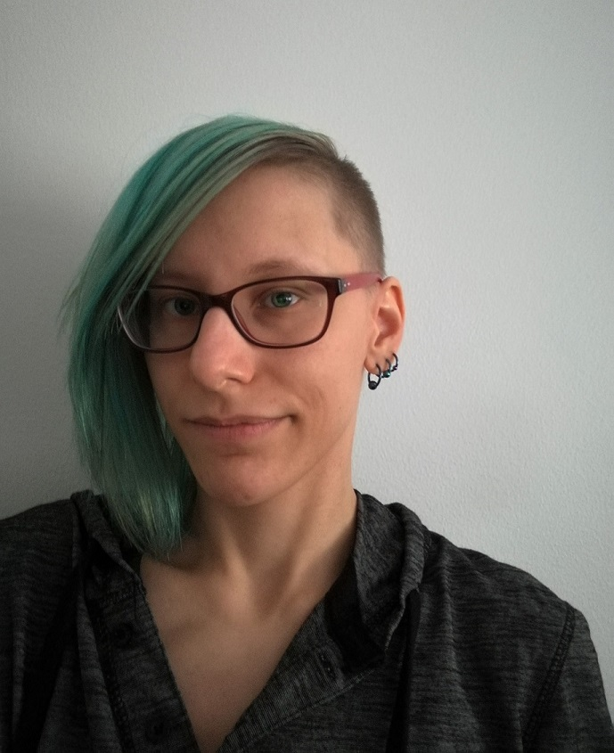

## Introduction

 I am a Language Technology major at the University of Helsinki. My interests include word-sense disambiguation, machine learning, and artificial intelligence. In my free time I like to draw, roller-skate, and play video games.

## Find me on

[GitHub](https://github.com/TiiKoh)

## Contact

My email address is of the form first_name.last_name@helsinki.fi. 

## Courses I've Taken

[Models and Algorithms in NLP-Applications](https://courses.helsinki.fi/en/lda-t3105), fall 2018

[Computational Semantics](https://courses.helsinki.fi/en/lda-t3103), fall 2017

[Building Natural Language Processing Applications](https://courses.helsinki.fi/en/kik-lg211), fall 2017

## Projects

This is the final assignment for the Command-line course.

[cmdline-course](https://github.com/TiiKoh/tiikoh.github.io)

## CV

[My CV](https://www.overleaf.com/read/qkmzvpjwcgwj)

## Misc. 

[InspiroBot](https://inspirobot.me/) 
